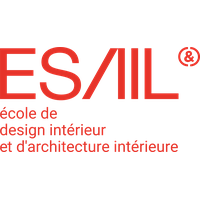
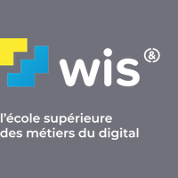
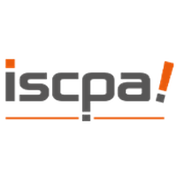

# WSPS — Wigor Schedule Provisioning Server

WSPS — Serveur API de collecte d’emploi du temps des écoles du groupe Compétences & Développement


---

Serveur d'approvisonnement d'emploi du temps et d'exposition d'emploi du temps non officiel, conçu pour les étudiants du réseaux d'écoles et de centre de formations [Compétences&Développement](https://www.competences-developpement.com/). **WSPS** fournit un moyen simple et automatique de récupérer l’emploi du temps de votre établissement appartenant au groupe [C&D](https://www.competences-developpement.com/) et qui utilise le service [WigorServices](wigorservices.net).


> [!NOTE]
> Ce projet n’est **pas affilié** aux écoles ou centres de formation du groupe [Compétences & Développement (C&D)](https://www.competences-developpement.com/) ni à [IGENSIA Education](https://www.igensia-education.fr/). Les fonctionnalités proposées **ne sont ni fournies ni soutenues** par ces groupes. Il s’agit d’une initiative indépendante, développée par un étudiant d’une des écoles du groupe C&D, visant à offrir une alternative pour exploiter et afficher les emplois du temps de vos établissements sur d’autres supports ou sous une forme différente du site officiel [WigorServices](wigorservices.net).
>
> Par conséquent, l’utilisation de WSPS se fait sous votre responsabilité. L’auteur du projet ne peut être tenu responsable d’éventuels risques ou problèmes liés à l’utilisation de ce projet Github.

> [!IMPORTANT]
> Ce projet est actuellement en développement actif. Certaines fonctionnalités peuvent être en cours d’implémentation et des bugs peuvent survenir. N’hésitez pas à partager vos retours afin d’aider à améliorer WSPS.

## Objetcif

Offrir une **API open-source** permettant aux étudiants et développeurs de **récupérer automatiquement les emplois du temps des écoles du groupe IGENSIA Education et Compétences & Développement, afin de les **intégrer facilement dans leurs propres applications ou services, sans proposer d’interface graphique ni de front-end officiel.

**Fonctionnalités principales :**

- Ajout facile de votre emploi du temps de classe à partir de vos identifiants élèves.
- Récupération répétée et entièrement automatique des emplois du temps.
- Conservation des différentes versions de l’emploi du temps pour chaque mise à jour.
- Mise à disposition d’une API exploitable pour intégrer les données dans vos propres projets.

## Écoles du groupe C&D et IGENSIA Education prises en charge

| Logo                                                                 | Établissement              | Testé |
| -------------------------------------------------------------------- | -------------------------- | ----- |
|                          | 3A                         | Non   |
|                        | EPSI                       | Oui   |
|                       | ESAIL                      | Non   |
|                         | ICL                        | Non   |
|       | IDRAC Business School      | Non   |
|                        | IEFT                       | Non   |
|                         | IET                        | Non   |
|                        | IFAG                       | Non   |
|                       | IGEFI                      | Non   |
|                     | IHEDREA                    | Non   |
|                       | ILERI                      | Non   |
|                  | SUP' DE COM                | Non   |
|                  | VIVA MUNDI                 | Non   |
|                         | WIS                        | Non   |
|   | American Business College  | Non   |
|                        | ESAM                       | Non   |
|         | ICD BUSINESS SCHOOL        | Non   |
|                  | IGENSIA RH                 | Non   |
|                        | IMIS                       | Non   |
|                        | IMSI                       | Non   |
|                         | IPI                        | Non   |
|                       | ISCPA                      | Non   |
|                        | ISMM                       | Non   |
|                        | CNVA                       | Non   |
|  | Business Science Institute | Non   |
|                         | ECM                        | Non   |
|                         | EMI                        | Non   |
|                         | ESA                        | Non   |

## Fonctionnement


## Pourquoi WSPS ?

WSPS a été créé pour offrir une alternative plus rapide et pratique au système officiel d’emploi du temps des écoles du groupe Compétences & Développement et IGENSIA Education. L’emploi du temps officiel est souvent lent et peu flexible, donc WSPS le récupère automatiquement via scraping et fournit un accès externe simple et rapide, utilisable dans vos propres applications ou services.

L’idée derrière WSPS est simple : fournir un serveur back-end capable de scrapper l’emploi du temps et de le rendre disponible via une API facile à utiliser, afin que n’importe quel étudiant ou développeur puisse :

- Récupérer automatiquement son emploi du temps,
- Intégrer ces données dans des applications personnelles (bots discord, widgets, calendrier…),
- Conserver un historique des versions pour suivre les changements.

En créant WSPS, l’objectif était de proposer une alternative non officielle, pratique et modulable, qui simplifie l’accès et l’exploitation des emplois du temps du groupe d'écoles C&D et IGENSIA Education.

## Déployer votre WSPS 


### Prérequis

Avant de déployer WSPS, il est important de prendre en compte quelques points clés afin de garantir le bon fonctionnement de l’application.

Ce serveur fournit une API et un outil de scraping, compatibles uniquement avec les écoles du groupe Compétences & Développement et IGENSIA Education.

WSPS est disponible exclusivement pour les étudiants inscrits dans les écoles du groupe Compétences & Développement et IGENSIA Education avec des identifiants actif. Cela s’explique par le fait que l’application repose sur le système spécifique d’emploi du temps utilisé par le groupe pour récupérer et traiter les données. Elle n’est donc compatible qu’avec la structure et le format des emplois du temps fournis par ces écoles.

> [!IMPORTANT]
>
> Pour fonctionner correctement, l’application nécessite des identifiants personnels de votre établissement scolaire. Cela signifie qu’il faut utiliser les identifiants d’un étudiant pour accéder aux données de l’emploi du temps.
> Si la classe partage le même emploi du temps, un seul compte suffit.
> Si des variations existent en fonction des programmes ou des cours de certains étudiants, il faudra fournir les identifiants de plusieurs comptes afin de récupérer plusieurs emplois du temps correspondant à chaque programme ou type de cours.

### 🐳 Déployer rapidement et éfficacement avec Docker

Après avoir installé **Docker**, exécutez les commandes suivantes :

```
docker-compose --env-file .env.docker up -d
```

Cette commande va déployer automatiquement tous les conteneurs Docker nécessaires au bon fonctionnement de WSPS.

Une fois le déploiement terminé, ouvrez votre navigateur et rendez-vous sur http://localhost:3000 pour accéder à l’application

## Comment contribuer

Pour obtenir tous les détails sur la contribution, y compris les directives pour soumettre des issues, pull requests et tests, consultez le fichier [CONTRIBUTING.md](CONTRIBUTING.md).

### Soumission d’issues

Utilisez le Issue Tracker pour signaler des bugs ou proposer de nouvelles fonctionnalités. Avant de créer une nouvelle issue, assurez-vous qu’aucune issue similaire n’est déjà ouverte.

### Tests fonctionnels

Toute personne qui teste manuellement le code et rapporte des bugs ou des suggestions d’améliorations dans le Issue Tracker est la bienvenue !

### Soumission de Pull Requests

Les correctifs et améliorations sont acceptés sous forme de pull requests (PR). Assurez-vous que l’issue à laquelle la PR se rapporte est ouverte dans le Issue Tracker.

Soumettre une pull request implique que vous acceptez de licencier votre contribution sous la **Mozilla Public License 2.0**.

## Licence

Ce projet est sous licence **Mozilla Public License 2.0**. Vous êtes libre d’**utiliser**, de **modifier** et de **distribuer le code** **conformément aux termes de cette licence**, à condition que **toute modification du code source soit également mise à disposition sous la même licence**. Pour plus de détails, veuillez consulter le fichier [LICENSE](LICENSE) dans le dépôt.
